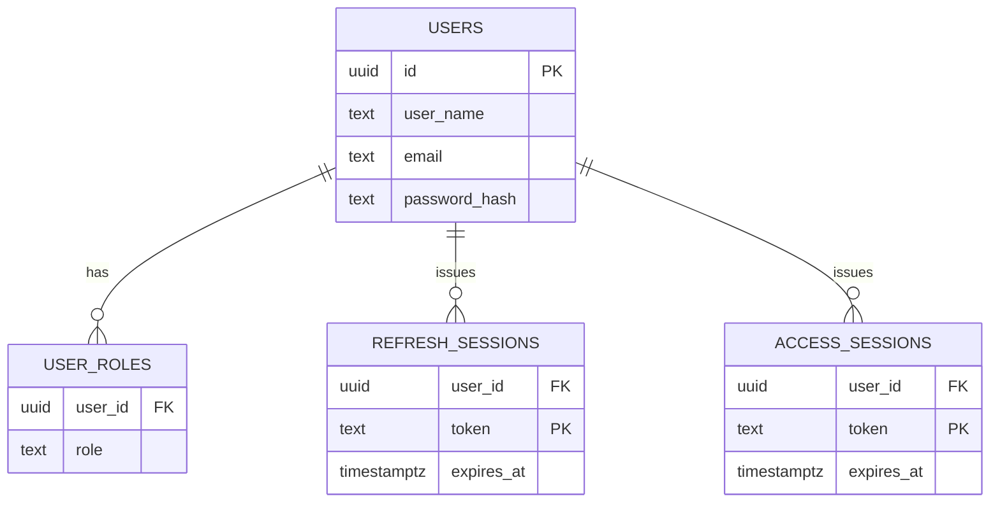
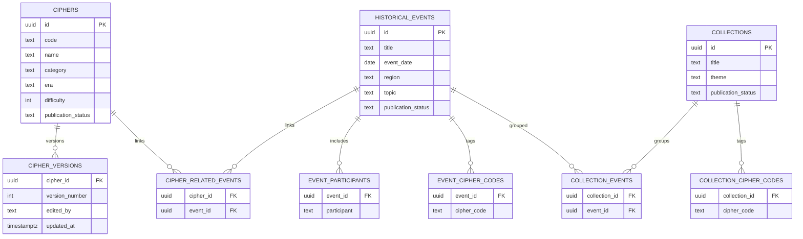
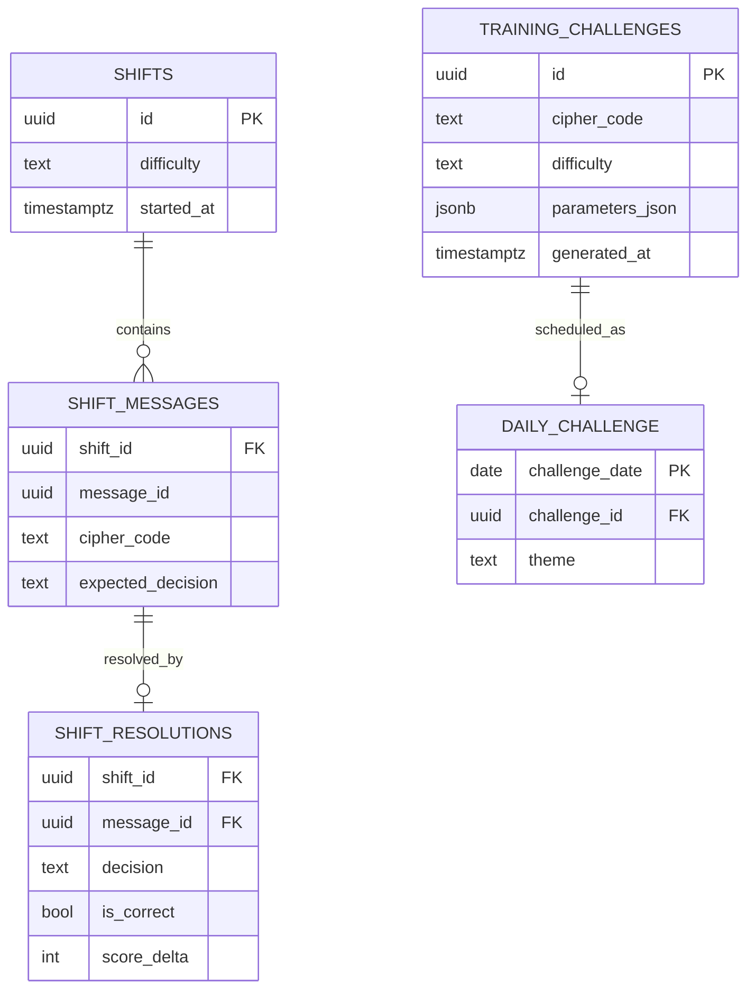
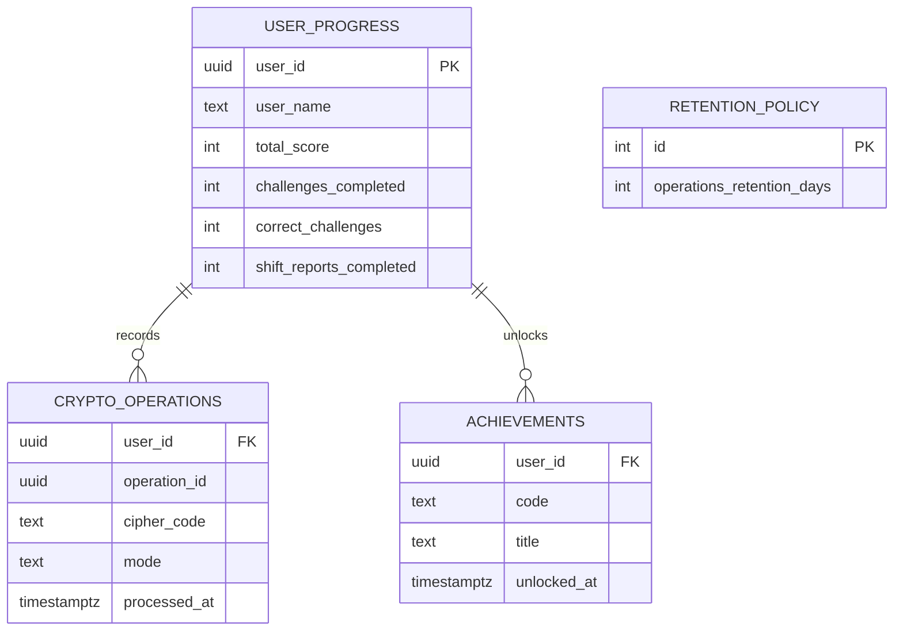

# ER Diagrams

## Auth schema

```mermaid
erDiagram
    USERS {
        uuid id PK
        text user_name
        text email
        text password_hash
    }
    USER_ROLES {
        uuid user_id FK
        text role
    }
    REFRESH_SESSIONS {
        uuid user_id FK
        text token PK
        timestamptz expires_at
    }
    ACCESS_SESSIONS {
        uuid user_id FK
        text token PK
        timestamptz expires_at
    }

    USERS ||--o{ USER_ROLES : has
    USERS ||--o{ REFRESH_SESSIONS : issues
    USERS ||--o{ ACCESS_SESSIONS : issues
```

## Content schema

```mermaid
erDiagram
    CIPHERS {
        uuid id PK
        text code
        text name
        text category
        text era
        int difficulty
        text publication_status
    }
    CIPHER_VERSIONS {
        uuid cipher_id FK
        int version_number
        text edited_by
        timestamptz updated_at
    }
    HISTORICAL_EVENTS {
        uuid id PK
        text title
        date event_date
        text region
        text topic
        text publication_status
    }
    CIPHER_RELATED_EVENTS {
        uuid cipher_id FK
        uuid event_id FK
    }
    EVENT_PARTICIPANTS {
        uuid event_id FK
        text participant
    }
    EVENT_CIPHER_CODES {
        uuid event_id FK
        text cipher_code
    }
    COLLECTIONS {
        uuid id PK
        text title
        text theme
        text publication_status
    }
    COLLECTION_EVENTS {
        uuid collection_id FK
        uuid event_id FK
    }
    COLLECTION_CIPHER_CODES {
        uuid collection_id FK
        text cipher_code
    }

    CIPHERS ||--o{ CIPHER_VERSIONS : versions
    CIPHERS ||--o{ CIPHER_RELATED_EVENTS : links
    HISTORICAL_EVENTS ||--o{ CIPHER_RELATED_EVENTS : links
    HISTORICAL_EVENTS ||--o{ EVENT_PARTICIPANTS : includes
    HISTORICAL_EVENTS ||--o{ EVENT_CIPHER_CODES : tags
    COLLECTIONS ||--o{ COLLECTION_EVENTS : groups
    HISTORICAL_EVENTS ||--o{ COLLECTION_EVENTS : grouped
    COLLECTIONS ||--o{ COLLECTION_CIPHER_CODES : tags
```

## Game schema

```mermaid
erDiagram
    TRAINING_CHALLENGES {
        uuid id PK
        text cipher_code
        text difficulty
        jsonb parameters_json
        timestamptz generated_at
    }
    SHIFTS {
        uuid id PK
        text difficulty
        timestamptz started_at
    }
    SHIFT_MESSAGES {
        uuid shift_id FK
        uuid message_id
        text cipher_code
        text expected_decision
    }
    SHIFT_RESOLUTIONS {
        uuid shift_id FK
        uuid message_id FK
        text decision
        bool is_correct
        int score_delta
    }
    DAILY_CHALLENGE {
        date challenge_date PK
        uuid challenge_id FK
        text theme
    }

    SHIFTS ||--o{ SHIFT_MESSAGES : contains
    SHIFT_MESSAGES ||--o| SHIFT_RESOLUTIONS : resolved_by
    TRAINING_CHALLENGES ||--o| DAILY_CHALLENGE : scheduled_as
```

## Progress schema

```mermaid
erDiagram
    USER_PROGRESS {
        uuid user_id PK
        text user_name
        int total_score
        int challenges_completed
        int correct_challenges
        int shift_reports_completed
    }
    CRYPTO_OPERATIONS {
        uuid user_id FK
        uuid operation_id
        text cipher_code
        text mode
        timestamptz processed_at
    }
    ACHIEVEMENTS {
        uuid user_id FK
        text code
        text title
        timestamptz unlocked_at
    }
    RETENTION_POLICY {
        int id PK
        int operations_retention_days
    }

    USER_PROGRESS ||--o{ CRYPTO_OPERATIONS : records
    USER_PROGRESS ||--o{ ACHIEVEMENTS : unlocks
```
